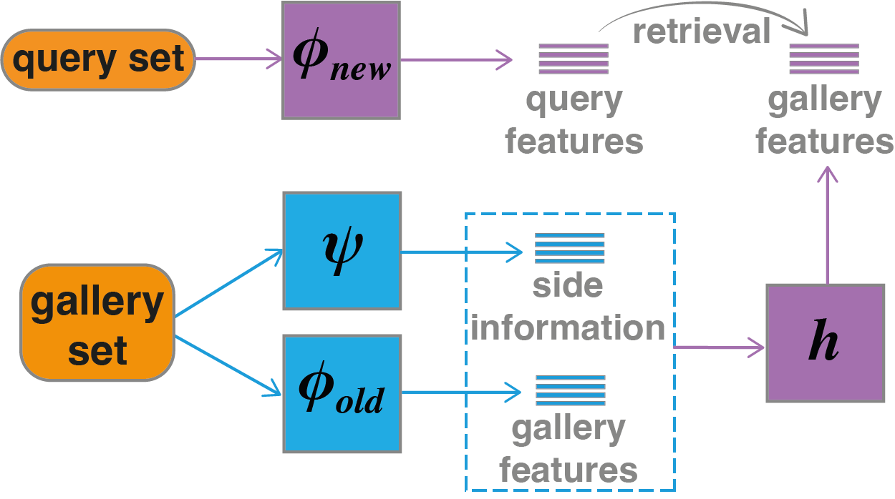

# Forward Compatible Training (FCT)



This repository is a PyTorch implementation of [Forward Compatible Training for Large-Scale Embedding Retrieval Systems](https://arxiv.org/abs/2112.02805) and can be used to reproduce the results in the paper.

**The code is written to use Python 3.7 or above.**

## Requirements

We suggest you first create a virtual environment and install dependencies in the virtual environment.

```bash
# Go to repo
cd <path/to/ml-fct>
# Create virtual environment ...
python -m venv .venv
# ... and activate it
source .venv/bin/activate
# Upgrade to the latest versions of pip and wheel
pip install -U pip wheel
pip install -r requirements.txt
```

## Quick Start (CIFAR100)

We provide CIFAR-100 experiment, for fast exploration. 
Here are the sequence of commands for cifar100 experiments (similar to ImageNet but faster cycles.):

```bash
# Get data: following command put data in data_store/cifar-100-python
python prepare_dataset.py

# Train old embedding model:
# Note: config files assume training with 8 GPUs. Modify them according to your environment.
python train_backbone.py --config configs/cifar100_backbone_old.yaml

# Evaluate the old model:
python eval.py --config configs/cifar100_eval_old_old.yaml

# Train New embedding model:
python train_backbone.py --config configs/cifar100_backbone_new.yaml

# Evaluate the new model:
python eval.py --config configs/cifar100_eval_new_new.yaml

# Download pre-traianed models if training with side-information:
source get_pretrained_models.sh

# Train FCT transformation:
# If training with side-info model add its path to the config file below. You
# can use the same side-info model as for ImageNet experiment here. 

python train_transformation.py --config configs/cifar100_transformation.yaml

# Evaluate transformed model vs new model:
python eval.py --config configs/cifar100_eval_old_new.yaml
```


| Case                                             | `CMC Top-1 (%)`  | `CMC Top-5 (%)`  | mAP (%) |
| -------------------------------------------------|:------:|:------:|:--------------:|
| [old/old](./configs/cifar100_backbone_old.yaml)  | 32.9 | 59.3 | 16.1 |
| [new/new](./configs/cifar100_backbone_new.yaml)  | 56.4 | 77.5 | 36.5 |
| [new/old](./configs/cifar100_transformation.yaml)| 50.6 | 74.2 | 34.2 |


## ImageNet Experiment

Here are the sequence of commands for ImageNet experiments:

```bash
# Get data: Prepare full ImageNet-1k dataset and provide its path in all config
# files. The path should include training and validation directories. 

# Train old embedding model:
# Note: config files assume training with 8 GPUs. Modify them according to your environment.
python train_backbone.py --config configs/imagenet_backbone_old.yaml

# Evaluate the old model:
python eval.py --config configs/imagenet_eval_old_old.yaml

# Train New embedding model:
python train_backbone.py --config configs/imagenet_backbone_new.yaml

# Evaluate the new model:
python eval.py --config configs/imagenet_eval_new_new.yaml

# Download pre-traianed models if training with side-information:
source get_pretrained_models.sh

# Train FCT transformation:
# (If training with side-info model add its path to the config file below)
python train_transformation.py --config configs/imagenet_transformation.yaml

# Evaluate transformed model vs new model:
python eval.py --config configs/imagenet_eval_old_new.yaml
```


| Case                                             | `CMC Top-1 (%)`  | `CMC Top-5 (%)`  | mAP (%) |
| -------------------------------------------------|:------:|:------:|:--------------:|
| [old/old](./configs/imagenet_backbone_old.yaml)  | 46.4 | 65.1 | 28.3 |
| [new/new](./configs/imagenet_backbone_new.yaml)  | 68.4 | 84.7 | 45.6 |
| [new/old](./configs/imagenet_transformation.yaml)| 65.1 | 82.7 | 44.0 |

## Contact

* **Hadi Pouransari**: mpouransari@apple.com

## Citation

```bibtex
@article{ramanujan2022forward,
  title={Forward Compatible Training for Large-Scale Embedding Retrieval Systems},
  author={Ramanujan, Vivek and Vasu, Pavan Kumar Anasosalu and Farhadi, Ali and Tuzel, Oncel and Pouransari, Hadi},
  journal={Proceedings of the IEEE conference on computer vision and pattern recognition},
  year={2022}
}
```
